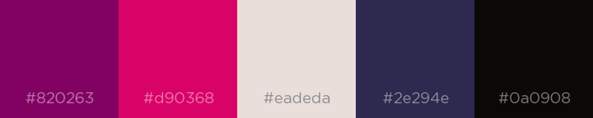

# FlashDeck2

## Quiz
This section is for simply testing yourself with flash cards.

## Manage
This section is for managing your flash cards.

## Color Themes

### Lala

 
#820263
 
#D90368
 
#EADEDA
 
#2E294E
 
#0A0908
